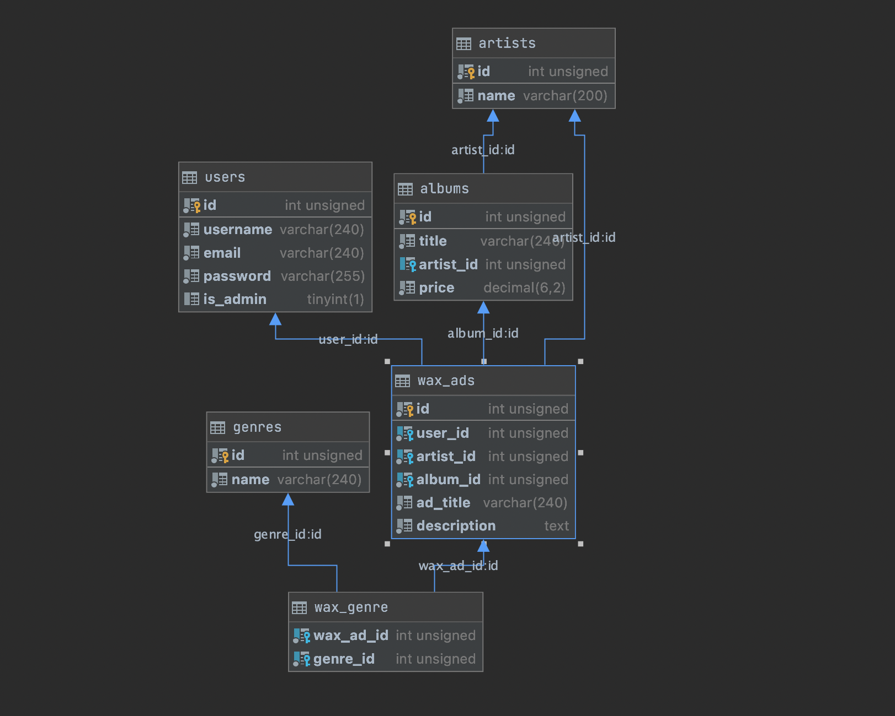

# W A X L I S T E R

---

### Table of Contents
- [Description](#description)
- [Features](#features)
- [Project Planning](#project-planning)
- [Author Information](#developers)

---

## Description
W A X L I S T E R is a full-stack web application for users, where they can create, view, update and delete wax ads.

#### Built With:
* Java
* MySQL
* HTML
* CSS
* Bootstrap

[Back To The Top](#W-A-X-L-I-S-T-E-R)

---

## Features
#### Ability To:
* Navigate to the app and see the landing page, containing the app main page with search option 
* Register for the app
* Login to be redirected to the user dashboard(profile) page
* View posts on the user dashboard(profile) of wax ads that user created.
* Add a wax ad
* Delete a wax ad that created by user 
* Edit details for created add by user
* Search through ad by album title
* Search through ad by artist name
* Ability to delete and update user profile  
* Logout of the app to be redirected to the landing page

[Back To The Top](#W-A-X-L-I-S-T-E-R)

---

## Project Planning
For this project, we utilized a Kanban Board to stay organized. We created a list of tasks and organized them into multiple columns. Because of this, we were easily able to assign ownership and track progress through various phases of development. Our go-to project planning resource was Trello.

* Check out our team Trello Board [HERE](https://trello.com/b/Faebw9yQ/kanban-board).
* Check out our database diagram below.

[Back To The Top](#W-A-X-L-I-S-T-E-R)

---

## Developers
[William Baldridge](https://github.com/WilliamBaldridge)

[Carlos Padilla](https://github.com/carlospadilla91)

[Yasin Mogultay](https://github.com/YasinMogultay)

---

[Back To The Top](#W-A-X-L-I-S-T-E-R)